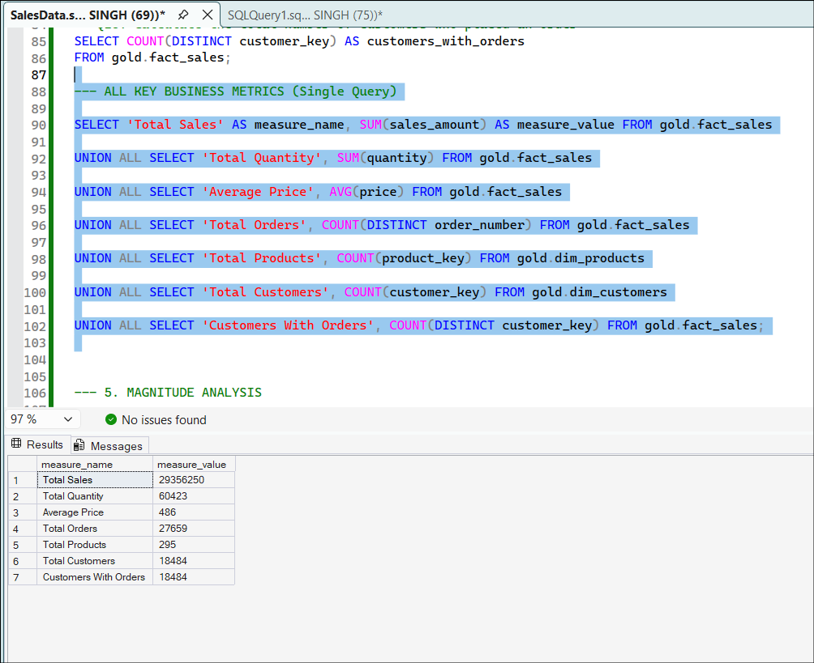
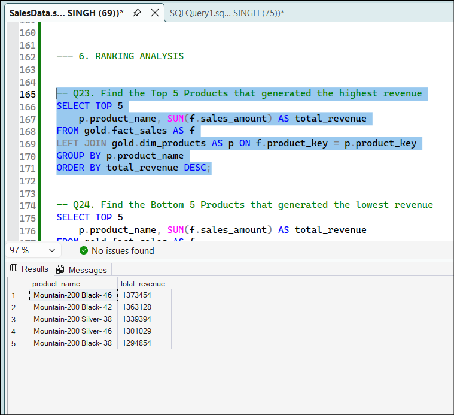
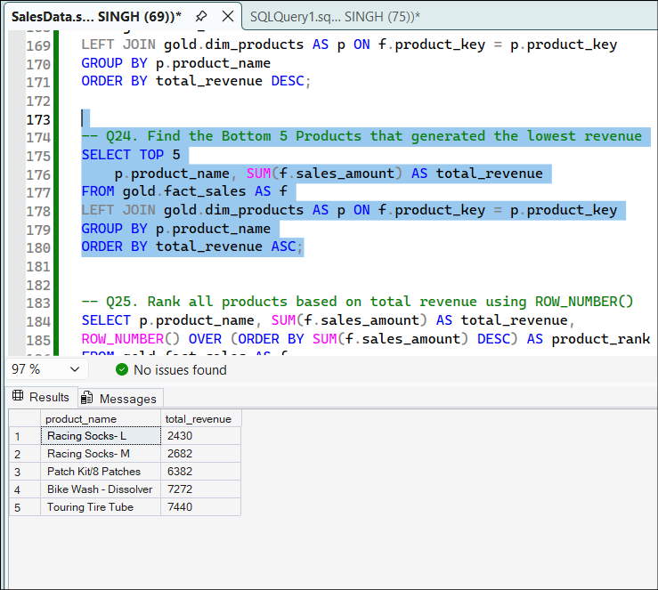
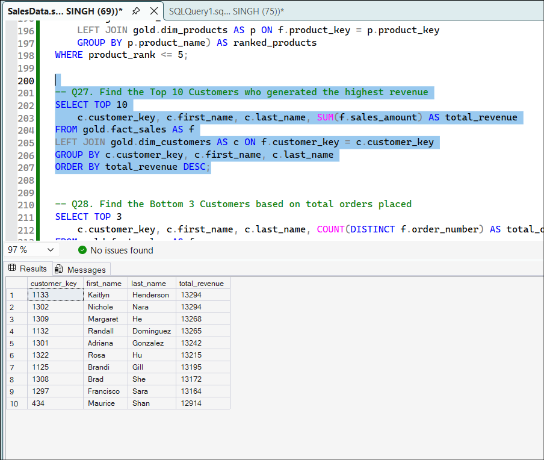
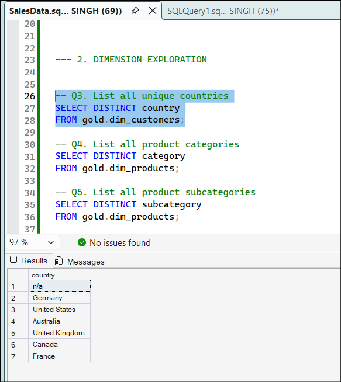
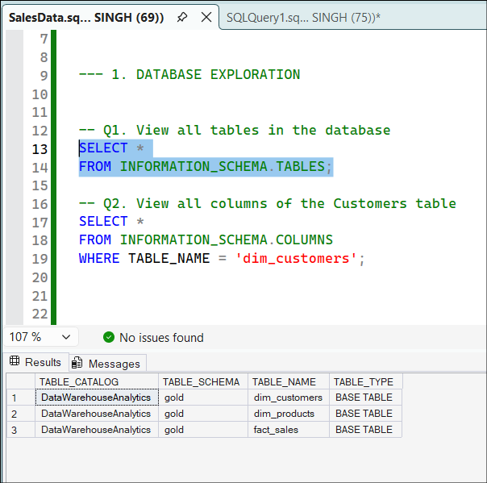
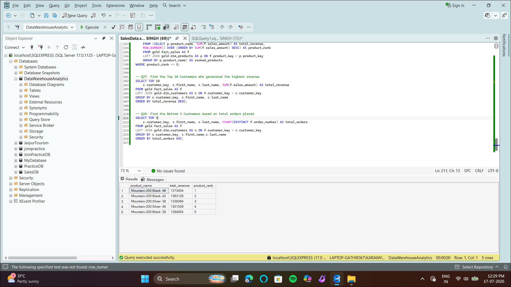

# 🚲 Bicycle & Cycling Gear Sales — SQL Server EDA


End-to-end exploratory data analysis on a retail sales data warehouse (`gold` schema — star model with `dim_customers`, `dim_products`, `fact_sales`) using T-SQL in SSMS, turning ~27.6K orders into product, customer, and revenue insights.

**Tools:** SQL Server / SSMS (T-SQL) · Window Functions · CTEs · `UNION ALL` metric rollups
**Data model:** `gold.dim_customers`, `gold.dim_products`, `gold.fact_sales`

---

## Key Business Metrics

Pulled from a single `UNION ALL` query against `fact_sales` and its dimension tables:

| Metric | Value |
|---|---|
| Total Sales Revenue | **$29,356,250** |
| Total Quantity Sold | 60,423 units |
| Average Selling Price | $486 |
| Total Orders | 27,659 |
| Total Products | 295 |
| Total Customers | 18,484 |
| Customers With Orders | 18,484 (100% of customer base has purchased) |



**Takeaway:** every customer on file has at least one order — there's no dormant/never-purchased segment in this dataset, so retention analysis would need order *frequency* (not activation) as the lens.

---

## Top & Bottom Performing Products

**Top 5 by revenue** — dominated by a single product line:

| Rank | Product | Revenue |
|---|---|---|
| 1 | Mountain-200 Black-46 | $1,373,454 |
| 2 | Mountain-200 Black-42 | $1,363,128 |
| 3 | Mountain-200 Silver-38 | $1,339,394 |
| 4 | Mountain-200 Silver-46 | $1,301,029 |
| 5 | Mountain-200 Black-38 | $1,294,854 |



**Bottom 5 by revenue** — low-cost accessories, as expected:

| Rank | Product | Revenue |
|---|---|---|
| 1 | Racing Socks-L | $2,430 |
| 2 | Racing Socks-M | $2,682 |
| 3 | Patch Kit/8 Patches | $6,382 |
| 4 | Bike Wash - Dissolver | $7,272 |
| 5 | Touring Tire Tube | $7,440 |



**Takeaway:** the entire top 5 is one bike model (Mountain-200) across colors/sizes — revenue is concentrated in a single SKU family, not spread across the catalog. That's a useful flag for inventory and marketing: the business is riding on one hero product.

---

## Top 10 Customers by Revenue

| Customer | Revenue |
|---|---|
| Kaitlyn Henderson | $13,294 |
| Nichole Nara | $13,294 |
| Margaret He | $13,268 |
| Randall Dominguez | $13,265 |
| Adriana Gonzalez | $13,242 |
| Rosa Hu | $13,215 |
| Brandi Gill | $13,195 |
| Brad She | $13,172 |
| Francisco Sara | $13,164 |
| Maurice Shan | $12,914 |



**Takeaway:** the top 10 customers are tightly clustered ($12.9K–$13.3K, a ~3% spread) — there's no single "whale" account. Combined they represent roughly 0.4% of revenue, so unlike many retail datasets, customer concentration risk here is low; the real revenue risk is product concentration (see above).

---

## Customer Distribution by Country

```sql
SELECT DISTINCT country FROM gold.dim_customers;
```

Customers span **7 markets**: United States, Germany, United Kingdom, Australia, Canada, France, and an "n/a" (unmapped) segment.



**Takeaway:** the "n/a" country value is worth surfacing to a data-quality conversation — it's a data-cleaning opportunity, not just a reporting footnote.

---

## Approach

1. **Explored the schema** — inventoried tables and columns via `INFORMATION_SCHEMA` before writing a single business query.
2. **Profiled dimensions** — distinct countries, categories, and subcategories to understand the grain of the data.
3. **Rolled up KPIs** — a single `UNION ALL` query producing all headline metrics in one result set (see below).
4. **Ranked performance** — `TOP N` and `ROW_NUMBER()` / `DENSE_RANK()` window functions to surface best/worst products and customers.
5. **Sanity-checked results** — cross-referenced customer and product counts against totals to confirm the numbers reconcile.

### Sample: Database Exploration
```sql
-- View all tables in the database
SELECT * FROM INFORMATION_SCHEMA.TABLES;

-- View all columns of the Customers table
SELECT * FROM INFORMATION_SCHEMA.COLUMNS
WHERE TABLE_NAME = 'dim_customers';
```


### Sample: All KPIs in One Query
```sql
SELECT 'Total Sales' AS measure_name, SUM(sales_amount) AS measure_value FROM gold.fact_sales
UNION ALL
SELECT 'Total Quantity', SUM(quantity) FROM gold.fact_sales
UNION ALL
SELECT 'Average Price', AVG(price) FROM gold.fact_sales
UNION ALL
SELECT 'Total Orders', COUNT(DISTINCT order_number) FROM gold.fact_sales
UNION ALL
SELECT 'Total Products', COUNT(product_key) FROM gold.dim_products
UNION ALL
SELECT 'Total Customers', COUNT(customer_key) FROM gold.dim_customers
UNION ALL
SELECT 'Customers With Orders', COUNT(DISTINCT customer_key) FROM gold.fact_sales;
```

### Sample: Top 5 Products by Revenue (Window Function)
```sql
SELECT product_name, total_revenue, product_rank
FROM (
    SELECT p.product_name, SUM(f.sales_amount) AS total_revenue,
           ROW_NUMBER() OVER (ORDER BY SUM(f.sales_amount) DESC) AS product_rank
    FROM gold.fact_sales AS f
    LEFT JOIN gold.dim_products AS p ON f.product_key = p.product_key
    GROUP BY p.product_name
) AS ranked_products
WHERE product_rank <= 5;
```

*(Full script: [`SalesData_EDA.sql`](./SalesData_EDA.sql) — 28 queries covering database exploration, dimension exploration, ranking, and magnitude analysis.)*



---

## SQL Techniques Used

`SELECT` · `WHERE` · `GROUP BY` · `ORDER BY` · Aggregate functions · `CASE WHEN` · `INNER/LEFT JOIN` · `DISTINCT` · `UNION ALL` · CTEs · Subqueries · Window functions (`ROW_NUMBER()`, `DENSE_RANK()`) · `TOP N` · `INFORMATION_SCHEMA` metadata queries

---

## Repository Structure

```
Sales-EDA
│
├── SalesData_EDA.sql        # All 28 analysis queries, organized by section
├── Database/                # Schema / DB setup scripts
├── Dataset/                 # Source data
├── Screenshots/             # Query outputs referenced in this README
└── README.md
```

---

## How to Run

1. Clone the repo: `git clone <repo-url>`
2. Restore/create the `DataWarehouseAnalytics` database in SQL Server using the scripts in `Database/`
3. Import the source tables from `Dataset/` into the `gold` schema (`dim_customers`, `dim_products`, `fact_sales`)
4. Open `SalesData_EDA.sql` in SSMS and run section by section
5. Compare your output against `Screenshots/` to verify results

---

## What I'd Do Next

- Investigate the product concentration risk found above — is the Mountain-200 line seasonal, or a structural dependency worth diversifying away from?
- Clean or investigate the "n/a" country segment rather than leaving it unclassified
- Add month-over-month trend analysis — this is currently a point-in-time snapshot
- Segment customers by order *frequency*, since revenue-per-customer alone shows no meaningful spread
- Build a Power BI dashboard on top of these queries for a live view of KPIs
- Wrap recurring queries into stored procedures for reuse

---

## Author

**Karamveer Singh**
Aspiring Data Analyst
**Skills:** SQL • Python • Power BI
[](https://www.linkedin.com/in/kar4mveer/)
[](https://github.com/kar4mveer)
